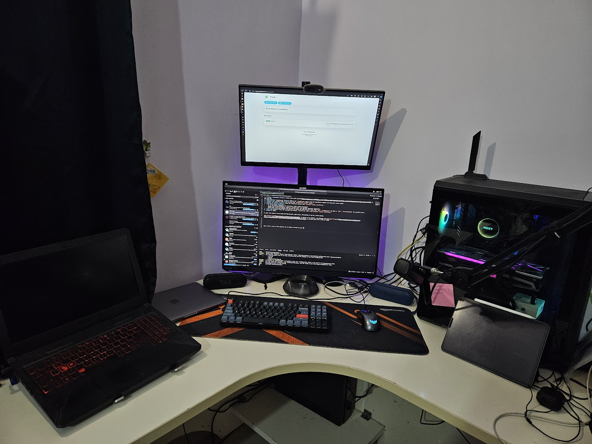

I remember back in 2017 when I started running a homelab. It was so difficult to access it outside the local area network because I didn't have a static IP. Even if you managed to get a static IP from your ISP, they would put it behind a CGNAT or something that just breaks it. I had so many issues with uptime only because the routing was messed up.
<!-- more -->

Fast forward to 2024, we now have Cloudflare Tunnels and Zero Trust, making remote access and security much easier.

Here's how you can set up and bring your server online in just a few minutes:

!!! note ""

    If you have no clue how to get started, follow this [guide](https://developers.cloudflare.com/cloudflare-one/connections/connect-networks/use-cases/ssh) on how to setup SSH with Cloudflare Tunnel


1. **Create a Cloudflare Tunnel**: Follow this quick [guide](https://developers.cloudflare.com/cloudflare-one/connections/connect-networks/get-started/create-remote-tunnel/) to get started.
2. **Download the `cloudflared` binary**: Obtain the `cloudflared` binary from the Cloudflare website and copy your access token.
3. **Install the service**: Start the service with `cloudflared install <token>`.
4. **Verify the service status**: Check the Cloudflare status with `systemctl status cloudflared`.
5. **Configure public hostnames**:
    - Go to the public hostnames tab and select "Add a public hostname".
    - Choose your preferred domain, such as `example.com`, and add any necessary subdomains.
    - Select the preferred protocol and specify the local URL with the port name, like `SSH -> localhost:22` for SSH or `HTTP -> localhost:3000` for an HTTP server.
6. **Save and restart**: Save the settings and restart `cloudflared` with `sudo systemctl restart cloudflared`.
7. **Done!**: Voila!

I spent only about 2 hours understanding Tunnels, Zero Trust, and setting it up on a fresh system. 

This [status page](https://uptime.kibibyte.in/status/public) is hosted on my homelab, and honestly the [pagesped insights](https://pagespeed.web.dev/analysis/https-uptime-kibibyte-in-status-public/kosoxj2eri?form_factor=desktop) are pretty good with a TTFB of 310ms.

I keep rest of my services behind [Zero Trust](https://developers.cloudflare.com/cloudflare-one/applications/configure-apps/self-hosted-apps/), which can be bypassed automatically if connected to WARP or by using a one-time PIN.

Here's a pic of setup: 



???+ example "Homelab Specs"

    ```
    OS: Ubuntu noble 24.04 x86_64
    Host: TUF GAMING FX504GD_FX80GD (1.0)
    Kernel: Linux 6.8.0-39-generic
    Uptime: 4 hours, 49 mins
    Packages: 1353 (dpkg), 6 (snap)
    Shell: bash 5.2.21
    CPU: Intel(R) Core(TM) i5-8300H (8) @ 4.00 GHz
    GPU 1: Intel UHD Graphics 630 @ 1.00 GHz [Integrated]
    GPU 2: NVIDIA GeForce GTX 1050 Mobile [Discrete]
    Memory: 2.47 GiB / 15.48 GiB (16%)
    Swap: 0 B / 4.00 GiB (0%)
    Disk (/): 14.14 GiB / 456.35 GiB (3%) - ext4
    Battery: 100% [AC Connected]
    Locale: en_US.UTF-8
    ```

It almost sounds like I'm promoting Cloudflare 😅, but they did a great job with a setup that requires minimal configuration to get started! Now, I have a variety of Linux distros for my friends and me to use! 😉


[^1]: I'm writing this to share my recent experience with Cloudflare Tunnels and a note for myself in future.
[^2]: Cloudflare Tunnels, Zero Trust Security, Homelab Hosting, Remote Access Solutions, Cloudflare Setup Guide, Home Server Configuration, Networking Tips, Secure Remote Access, Linux Homelab, Cloudflare for Developers, Accessing localhost on the internet