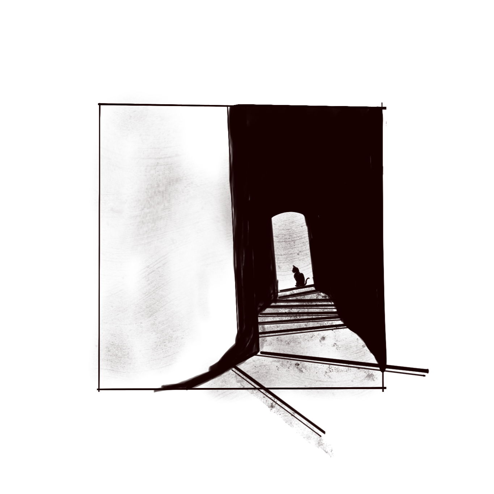
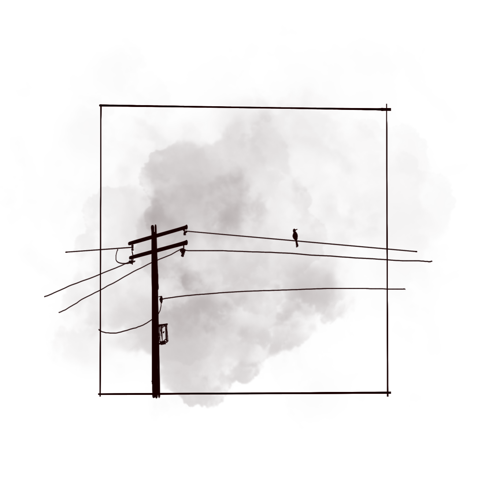
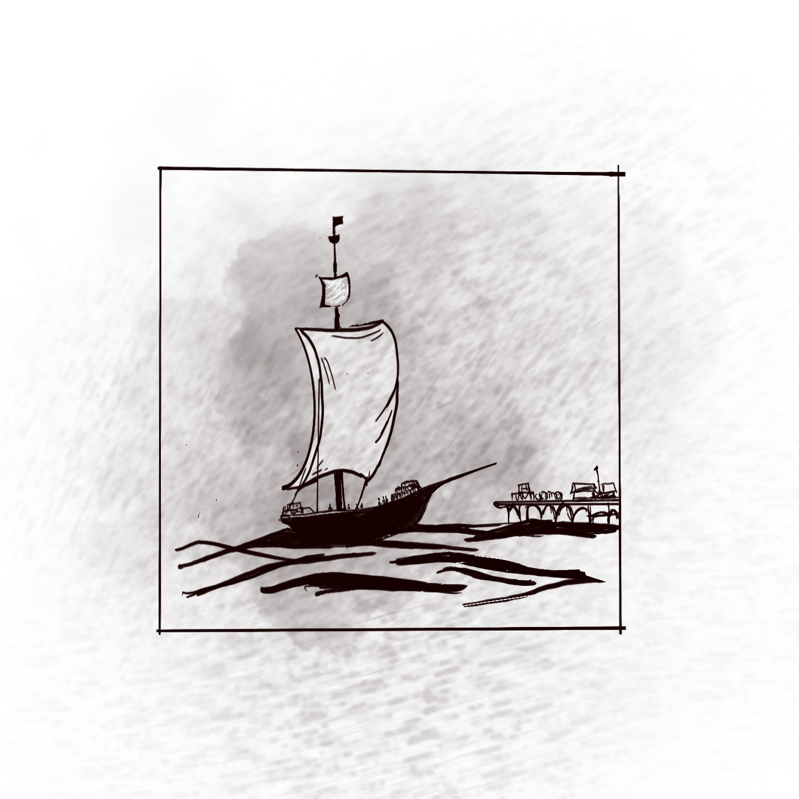
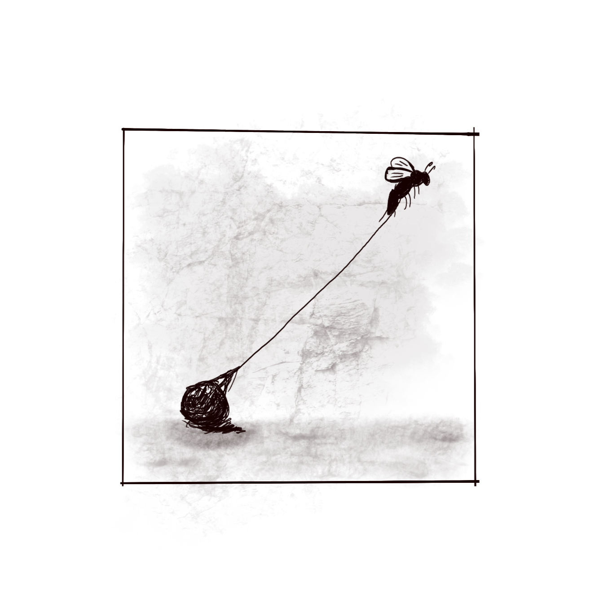
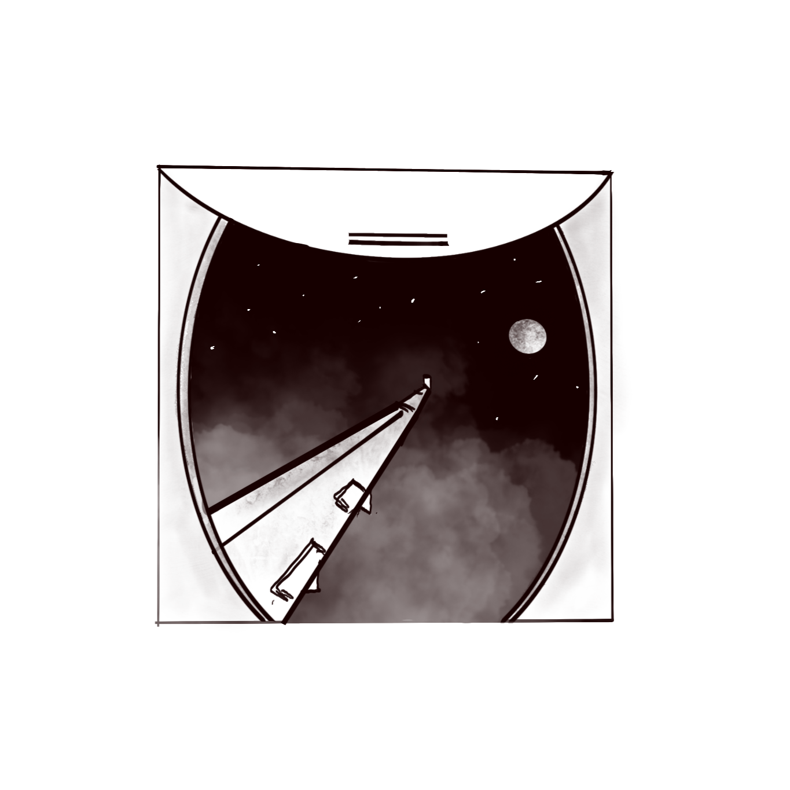
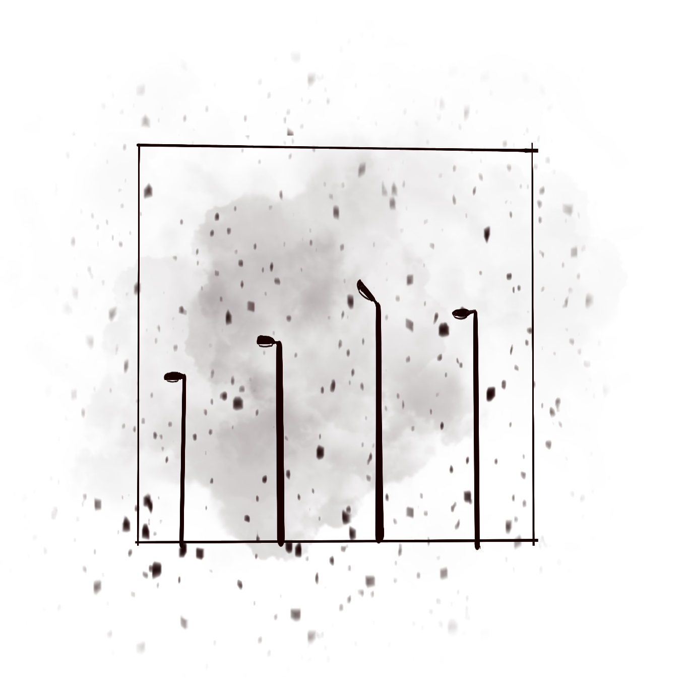

These illustrations are abstract, but if you think about it enough, especially on difficult days, they reveal profound meanings:

Lost. Desolation. Drifting. Burdened. Abyss. Forsaken.

Yet, the same illustrations can also evoke:
Discovery. Peace. Freedom. Determination. Aspiration. Reflection.

I drew these to remind myself of how depression affects perception. I've learned to avoid concluding moments in my life too quickly and instead, leave them open-ended to see where they take me.
<!-- more -->

