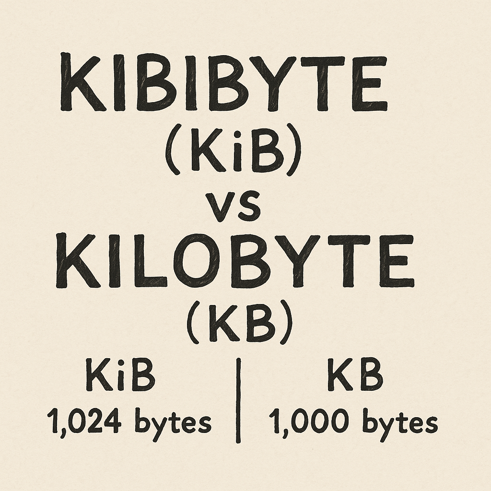

Have you ever wondered why your computer's storage space seems smaller than what was advertised? Part of the answer lies in how data size units like Kibibyte (KiB) and Kilobyte (KB) are defined. Although they sound similar, they represent different amounts of data — and knowing the difference can help you avoid confusion.
<!-- more -->

### Quick Definitions

Let's start with the basic definitions:

| Unit | Abbreviation | Size |
|:-----|:-------------|:-----|
| Kilobyte | KB | 1,000 bytes |
| Kibibyte | KiB | 1,024 bytes |

Notice the small difference? It may seem trivial, but at larger scales, the gap between 1,000 and 1,024 becomes very significant.

---

### Why Do Both Terms Exist?

Originally, "kilobyte" was loosely used to mean both 1,000 and 1,024 bytes depending on the context.  
This caused a lot of confusion, especially as storage devices became larger.

To fix this, in 1998, the **International Electrotechnical Commission (IEC)** introduced new binary prefixes:
- **KiB** = 1,024 bytes
- **MiB** = 1,048,576 bytes (1024² bytes)
- **GiB**, and so on.

This way, the binary and decimal systems were clearly separated.

---

### Real-World Example: Hard Drives

Let's say you buy a "500 GB" hard drive.

- **Manufacturer’s calculation** (decimal):  
  1 GB = 1,000,000,000 bytes
  → 500 × 1,000,000,000 = 500,000,000,000 bytes

- **Computer's calculation** (binary, using GiB/KiB etc.):  
  1 GiB = 1,073,741,824 bytes  
  → 500,000,000,000 ÷ 1,073,741,824 ≈ 465 GiB

**Result**:  
Your OS shows **465 GiB** instead of **500 GB**.  
No, you didn't lose space — the math is just different!

---

### Common Mistake: Using KB and KiB Interchangeably

Even today, many apps, websites, and tech specs **incorrectly** use KB when they mean KiB.

| Situation | Correct Unit |
|:----------|:-------------|
| RAM size | KiB, MiB, GiB |
| File download size (networking) | KB, MB, GB (decimal-based) |

If accuracy matters (like for developers, engineers, or nerds like us 😎), you should always check which system is being used.

---

### Conclusion

Understanding the difference between **Kibibyte** and **Kilobyte** isn't just academic — it impacts real-world storage, software, and hardware calculations.  
When in doubt, remember:
- **KiB** = 1,024 bytes (binary world 🌐)
- **KB** = 1,000 bytes (marketing world 📣)

And if your new hard drive looks smaller than expected, blame the prefixes — not the seller!

---

[^1]: This post is part of my ongoing series simplifying misunderstood computer concepts.
[^2]: Kibibyte, Kilobyte, IEC Units, Data Storage, Binary vs Decimal, Computer Basics, Storage Calculations, Hard Drive Capacity, Computing Units Explained
